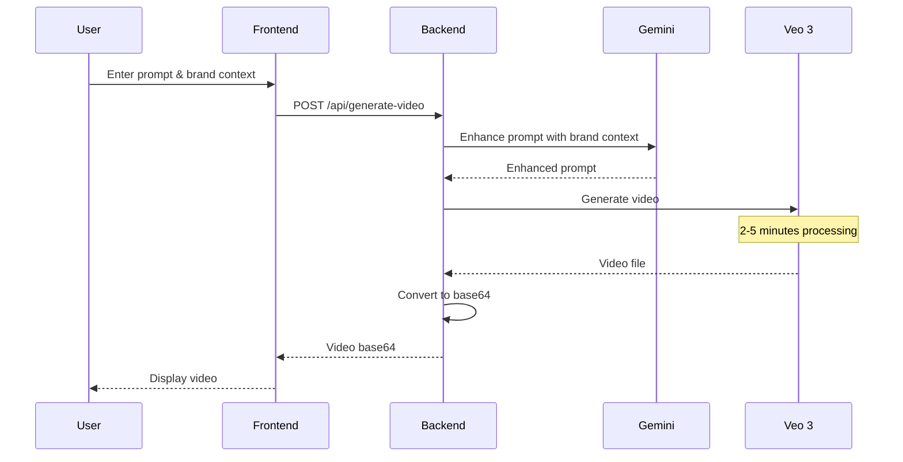
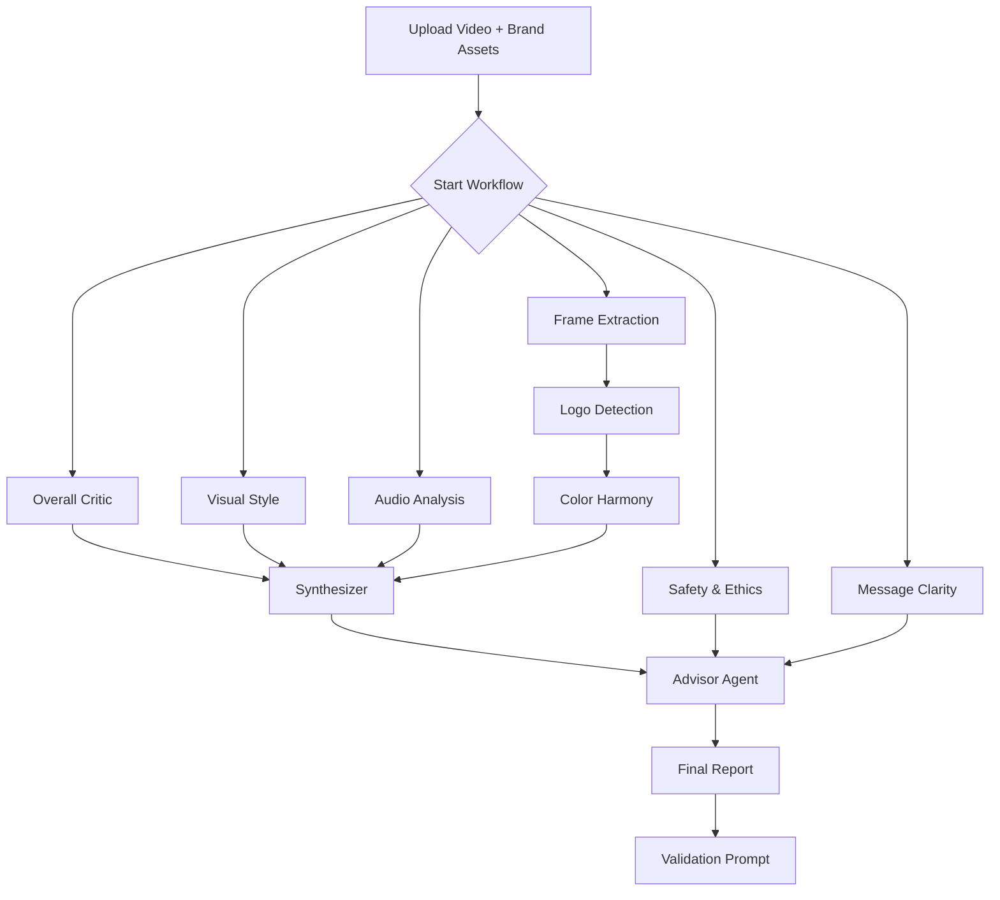

# AdVisor 🎬✨

**AI-Powered Brand Alignment & Quality Assurance for Video Advertisements**

> Build trust in AI-generated ads through comprehensive multi-agent critique workflows

AdVisor is an end-to-end platform that generates professional video advertisements using **Google Veo 3** and validates them through a sophisticated multi-agent AI system powered by **Google Gemini 2.0**. The platform specializes in **brand alignment verification** using cutting-edge computer vision and AI techniques.

[](https://nextjs.org/)
[](https://fastapi.tiangolo.com/)
[](https://ai.google.dev/)
[](https://deepmind.google/technologies/veo/)

---

## 🎯 Overview

### The Problem

AI-generated video advertisements often suffer from:
- **Brand misalignment**: Colors, logos, and messaging that don't match brand guidelines
- **Inconsistent quality**: Visual artifacts, poor composition, unclear messaging
- **Lack of trust**: Companies hesitate to use AI ads without rigorous quality control
- **Manual review bottleneck**: Time-consuming human validation of every AI-generated asset

### The Solution

AdVisor provides **automated, comprehensive quality assurance** through:

1. **🎨 AI Video Generation**: Create 5-15 second ads from text prompts using Google Veo 3
2. **🔍 Multi-Agent Analysis**: 8+ specialized AI agents evaluate every aspect of your ad
3. **📊 Quantified Scoring**: Get objective metrics (0-1 scores) for brand alignment, visual quality, and tone
4. **🔄 Iterative Improvement**: Auto-generated validation prompts enable systematic refinement
5. **✅ Brand Compliance**: Ensure logo visibility, color harmony, and message clarity

---

## 🏆 Key Features

### 1. Video Ad Generation
- **Google Veo 3 Integration**: State-of-the-art video generation from text
- **Smart Prompt Engineering**: AI-enhanced prompts for better results
- **Brand-Aware Generation**: Incorporate company/product context into generation

### 2. Brand Alignment Analysis

#### 🎨 **Logo Detection** (Computer Vision + CLIP)
- Multi-scale OpenCV template matching for precise logo localization
- **CLIP similarity scoring** for semantic logo recognition
- Confidence scores and bounding box visualization
- Detects multiple logo instances across video frames

#### 🌈 **Color Harmony Analysis** (CV + K-Means)
- **K-means clustering** to extract 5 dominant colors per frame
- **RGB to HEX conversion** for exact color matching
- Compares detected palette against official brand colors
- Analyzes color distribution and consistency across frames
- Uses `scikit-learn` for efficient color clustering

#### 🔊 **Audio Brand Alignment** (Multi-Modal AI)
- Gemini-powered audio analysis with multi-modal input
- Evaluates tone of voice, music style, and sound effects
- Assesses brand voice consistency and audio quality
- Checks for appropriate messaging and pronunciation

### 3. Comprehensive Quality Assurance

#### Visual Style Agent
- Composition and aesthetic evaluation
- Lighting, framing, and visual consistency analysis
- Production value assessment

#### Safety & Ethics Agent
- Harmful content detection
- Stereotype and bias identification
- Misleading claims verification
- Regulatory compliance checking

#### Message Clarity Agent
- Product visibility assessment
- Tagline correctness validation
- Call-to-action effectiveness
- Communication clarity scoring

#### Synthesizer Agent
- Aggregates insights from all specialized agents
- Identifies patterns across multiple analyses
- Generates unified brand alignment report

#### Advisor Agent (Final Report)
- Comprehensive scoring (brand alignment, visual quality, tone accuracy)
- Detailed justifications for all metrics
- Violation and off-brand element detection
- **Validation prompt generation** for automated improvement

### 4. Developer Experience

- **Interactive Workflow Visualization**: Real-time agent execution graph with ReactFlow
- **RESTful API**: Clean FastAPI endpoints for all agents
- **Type-Safe Schemas**: Pydantic models with automatic validation
- **Structured Outputs**: JSON responses with consistent formatting
- **Cost Optimization**: Configurable dummy modes for development

---

## 🏗️ Architecture

### System Overview

```
┌─────────────────────────────────────────────────────────────┐
│                    Next.js Frontend (Port 3000)              │
│  ┌──────────────┐  ┌──────────────┐  ┌──────────────┐      │
│  │ Ad Generator │  │  Workflow    │  │   Results    │      │
│  │  Interface   │  │     Graph    │  │   Dashboard  │      │
│  └──────────────┘  └──────────────┘  └──────────────┘      │
└────────────────────────────┬────────────────────────────────┘
                             │ HTTP/REST API
                             ↓
┌─────────────────────────────────────────────────────────────┐
│                 FastAPI Backend (Port 8000)                  │
│  ┌──────────────────────────────────────────────────────┐   │
│  │           Workflow Orchestration Layer               │   │
│  │      (Coordinates agent execution & data flow)       │   │
│  └──────────────────────────────────────────────────────┘   │
│                             ↓                                │
│  ┌──────────────────────────────────────────────────────┐   │
│  │              Multi-Agent System                      │   │
│  │                                                      │   │
│  │  ┌─────────────── PARALLEL PHASE ─────────────────┐ │   │
│  │  │                                                 │ │   │
│  │  │  ┌─────────────────┐  ┌──────────────────┐    │ │   │
│  │  │  │ Overall Critic  │  │  Visual Style    │    │ │   │
│  │  │  │    (Gemini)     │  │    (Gemini)      │    │ │   │
│  │  │  └─────────────────┘  └──────────────────┘    │ │   │
│  │  │                                                 │ │   │
│  │  │  ┌─────────────────┐  ┌──────────────────┐    │ │   │
│  │  │  │ Frame Extractor │  │ Audio Analysis   │    │ │   │
│  │  │  │   (OpenCV)      │  │    (Gemini)      │    │ │   │
│  │  │  └─────────────────┘  └──────────────────┘    │ │   │
│  │  │                                                 │ │   │
│  │  │  ┌─────────────────┐  ┌──────────────────┐    │ │   │
│  │  │  │ Safety & Ethics │  │ Message Clarity  │    │ │   │
│  │  │  │    (Gemini)     │  │    (Gemini)      │    │ │   │
│  │  │  └─────────────────┘  └──────────────────┘    │ │   │
│  │  └─────────────────────────────────────────────┘ │   │
│  │                             ↓                      │   │
│  │  ┌───────────── SEQUENTIAL PHASE ───────────────┐ │   │
│  │  │                                               │ │   │
│  │  │  ┌─────────────────────────────────────┐    │ │   │
│  │  │  │      Logo Detection Agent           │    │ │   │
│  │  │  │  • OpenCV Template Matching         │    │ │   │
│  │  │  │  • CLIP Similarity Scoring          │    │ │   │
│  │  │  │  • Bounding Box Extraction          │    │ │   │
│  │  │  └─────────────────────────────────────┘    │ │   │
│  │  │                     ↓                        │ │   │
│  │  │  ┌─────────────────────────────────────┐    │ │   │
│  │  │  │    Color Harmony Agent              │    │ │   │
│  │  │  │  • K-Means Color Clustering         │    │ │   │
│  │  │  │  • HEX Color Extraction             │    │ │   │
│  │  │  │  • Brand Palette Comparison         │    │ │   │
│  │  │  └─────────────────────────────────────┘    │ │   │
│  │  └───────────────────────────────────────────┘ │   │
│  │                             ↓                      │   │
│  │  ┌──────────── AGGREGATION PHASE ──────────────┐ │   │
│  │  │                                              │ │   │
│  │  │  ┌─────────────────────────────────────┐   │ │   │
│  │  │  │     Synthesizer Agent (Gemini)      │   │ │   │
│  │  │  │  Aggregates brand alignment data    │   │ │   │
│  │  │  └─────────────────────────────────────┘   │ │   │
│  │  │                     ↓                       │ │   │
│  │  │  ┌─────────────────────────────────────┐   │ │   │
│  │  │  │      Advisor Agent (Gemini)         │   │ │   │
│  │  │  │  • Final scoring & justifications   │   │ │   │
│  │  │  │  • Violation detection              │   │ │   │
│  │  │  │  • Validation prompt generation     │   │ │   │
│  │  │  └─────────────────────────────────────┘   │ │   │
│  │  └──────────────────────────────────────────┘ │   │
│  └──────────────────────────────────────────────────┘   │
└─────────────────────────────────────────────────────────────┘
                             │
                             ↓
┌─────────────────────────────────────────────────────────────┐
│                   External AI Services                       │
│  ┌──────────────┐  ┌──────────────┐  ┌──────────────┐      │
│  │   Veo 3      │  │  Gemini 2.0  │  │  CLIP Model  │      │
│  │   (Video)    │  │  (Analysis)  │  │   (Vision)   │      │
│  └──────────────┘  └──────────────┘  └──────────────┘      │
└─────────────────────────────────────────────────────────────┘
```

### Technology Stack

#### Frontend
- **Next.js 16** with App Router
- **React 19** with Server Components
- **TypeScript** for type safety
- **TailwindCSS 4** for styling
- **ReactFlow 11** for workflow visualization
- **Mastra** for workflow orchestration
- **Zod** for schema validation

#### Backend
- **FastAPI** (Python) - High-performance async web framework
- **Uvicorn** - Lightning-fast ASGI server
- **Pydantic** - Data validation and settings management
- **python-dotenv** - Environment variable handling

#### AI & Machine Learning
- **Google Veo 3** via Vertex AI - Video generation
- **Google Gemini 2.0 Flash Exp** - Multi-modal AI analysis
- **CLIP** (via Transformers) - Logo semantic similarity
- **OpenCV** - Frame extraction, image processing, template matching
- **scikit-learn** - K-means clustering for color analysis
- **NumPy** - Efficient numerical computations

#### Development Tools
- **ESLint** - Code linting
- **PostCSS** - CSS processing
- **Git** - Version control

---

## 📋 Prerequisites

Before you begin, ensure you have:

1. **Python 3.10 or higher**
   ```bash
   python --version
   ```

2. **Node.js 18 or higher** with npm
   ```bash
   node --version
   npm --version
   ```

3. **Google Cloud Account** (for Veo 3 video generation)
   - Project with billing enabled
   - Vertex AI API enabled
   - Authentication configured

4. **Google AI API Key** (for Gemini analysis)
   - Get your API key from [Google AI Studio](https://aistudio.google.com/app/apikey)

5. **Git** for cloning the repository

---

## 🚀 Installation & Setup

### Step 1: Clone the Repository

```bash
git clone <repository-url>
cd hacknation_2025_11
```

### Step 2: Backend Setup

#### 2.1 Navigate to Backend Directory

```bash
cd AdVisor/backend
```

#### 2.2 Create Virtual Environment

```bash
# Using standard Python venv
python -m venv .venv

# Or using uv (faster)
uv venv
```

#### 2.3 Activate Virtual Environment

**Windows (PowerShell):**
```powershell
.venv\Scripts\Activate.ps1
```

**Windows (CMD):**
```cmd
.venv\Scripts\activate.bat
```

**Linux/Mac:**
```bash
source .venv/bin/activate
```

#### 2.4 Install Python Dependencies

```bash
# If using pip
pip install -r ../../requirements.txt

# If using uv (much faster)
uv pip install -r ../../requirements.txt
```

**Dependencies installed:**
- `fastapi` - Web framework
- `google-genai` - Google Gemini AI SDK
- `numpy` - Numerical operations
- `opencv-python` - Computer vision & video processing
- `python-dotenv` - Environment configuration
- `pydantic-settings` - Settings management
- `scikit-learn` - Machine learning (K-means clustering)
- `uvicorn[standard]` - ASGI server with performance extras

#### 2.5 Configure Environment Variables

Create `.env` file in the `backend/` directory:

```bash
# Copy template
cp .env.example .env  # if available, or create manually

# Edit .env file
nano .env  # or use your preferred editor
```

**Required `.env` contents:**

```env
# ============================================
# REQUIRED: Google Gemini API Key
# ============================================
# Get your key from: https://aistudio.google.com/app/apikey
GOOGLE_API_KEY=your_google_gemini_api_key_here

# ============================================
# OPTIONAL: Server Configuration
# ============================================
LOG_LEVEL=INFO
ALLOWED_ORIGINS=http://localhost:3000,http://127.0.0.1:3000

# ============================================
# OPTIONAL: Agent Dummy Modes
# Set to "true" to skip AI calls for specific agents
# (Useful for testing without consuming API credits)
# ============================================
USE_DUMMY_OVERALL_CRITIC=false
USE_DUMMY_VISUAL_STYLE=false
USE_DUMMY_AUDIO_ANALYSIS=false
USE_DUMMY_SYNTHESIZER=false
USE_DUMMY_SAFETY_ETHICS=false
USE_DUMMY_MESSAGE_CLARITY=false
USE_DUMMY_ADVISOR=false

# ============================================
# OPTIONAL: Google Cloud (for Veo 3)
# ============================================
GOOGLE_CLOUD_PROJECT_ID=your-project-id
GOOGLE_CLOUD_LOCATION=us-central1
# GOOGLE_APPLICATION_CREDENTIALS=/path/to/service-account.json
```

#### 2.6 Start Backend Server

```bash
# From backend/ directory with activated venv
uvicorn app.main:app --reload --host 0.0.0.0 --port 8000
```

**Expected output:**
```
INFO:     Uvicorn running on http://0.0.0.0:8000 (Press CTRL+C to quit)
INFO:     Started reloader process [xxxxx]
INFO:     Started server process [xxxxx]
INFO:     Waiting for application startup.
INFO:     Application startup complete.
```

**Verify backend is running:**
```bash
# In a new terminal
curl http://localhost:8000/healthz
# Should return: {"status":"ok"}
```

### Step 3: Frontend Setup

#### 3.1 Navigate to Frontend Directory

```bash
# From project root
cd AdVisor/advisor
```

#### 3.2 Install Node Dependencies

```bash
npm install
```

**Dependencies installed:**
- `next@16.0.1` - React framework
- `react@19.2.0` - UI library
- `react-dom@19.2.0` - React DOM bindings
- `@google/genai` - Google GenAI SDK
- `mastra@0.18.0` - Workflow orchestration
- `reactflow@11.11.4` - Interactive workflow graphs
- `zod@3.25.76` - Schema validation
- `tailwindcss@4` - Utility-first CSS
- `typescript@5` - Type safety

#### 3.3 Configure Environment Variables

Create `.env.local` file in the `advisor/` directory:

```bash
# Create file
touch .env.local  # Linux/Mac
# or
type nul > .env.local  # Windows

# Edit file
nano .env.local  # or use your preferred editor
```

**Required `.env.local` contents:**

```env
# Backend API URL
# Use the URL where your FastAPI backend is running
NEXT_PUBLIC_BACKEND_URL=http://localhost:8000

# Alternative variable name (both work)
BACKEND_BASE_URL=http://localhost:8000
```

#### 3.4 Start Frontend Development Server

```bash
# From advisor/ directory
npm run dev
```

**Expected output:**
```
  ▲ Next.js 16.0.1
  - Local:        http://localhost:3000
  - Network:      http://192.168.x.x:3000

 ✓ Starting...
 ✓ Ready in 2.5s
```

### Step 4: Verify Installation

1. **Backend Health Check**
   - Visit: http://localhost:8000/healthz
   - Expected: `{"status":"ok"}`

2. **Backend API Documentation**
   - Visit: http://localhost:8000/docs
   - You should see interactive FastAPI documentation

3. **Frontend Application**
   - Visit: http://localhost:3000
   - You should see the AdVisor interface

4. **Test Ad Generation Page**
   - Visit: http://localhost:3000 (main page)
   - Should show ad generator interface

5. **Test Analysis Page**
   - Visit: http://localhost:3000/analyze
   - Should show ad analysis interface

---

## 🎮 Usage Guide

### Generating a Video Ad

1. **Navigate to Home Page**
   - Go to http://localhost:3000

2. **Fill in Brand Information**
   - **Company Name**: e.g., "Apple"
   - **Product Name**: e.g., "iPhone 16 Pro"
   - **Creative Brief** (optional): e.g., "Focus on cinematic video capabilities"

3. **Enter Video Prompt**
   - Example: "A professional photographer capturing stunning sunset photos with iPhone 16 Pro, showcasing the camera's advanced features in a beautiful mountain landscape"

4. **Generate Video**
   - Click "Generate Ad"
   - Wait for Veo 3 to generate your video (typically 2-5 minutes)

5. **Review Generated Video**
   - Video will display in the interface
   - Download if needed

### Analyzing a Video Ad

1. **Navigate to Analysis Page**
   - Click "Or analyze an existing ad →" or go to http://localhost:3000/analyze

2. **Upload Video File**
   - Click video upload area
   - Select your video file (.mp4 recommended)
   - File will be automatically converted to base64

3. **Provide Brand Context**
   - **Company Name**: Your brand name
   - **Product Name**: Product being advertised
   - **Creative Brief** (optional): Brand guidelines, target audience, key messages

4. **Upload Brand Assets**
   - **Brand Logo** (required): Upload your logo image (PNG/JPG)
   - **Product Image** (optional): Upload product reference image

5. **Optional: Include Original Prompt**
   - If you have the original prompt used to generate the video, include it

6. **Run Analysis Workflow**
   - Click "Analyze Ad"
   - Watch the workflow graph as agents execute in real-time

7. **Monitor Agent Execution**
   - **Green nodes**: Successfully completed
   - **Yellow nodes**: In progress
   - **Red nodes**: Failed (with error details)
   - Click any node to see detailed inputs/outputs

8. **Review Results**

   **Brand Alignment Score (0-1):**
   - 0.9-1.0: Excellent alignment
   - 0.7-0.89: Good alignment with minor issues
   - 0.5-0.69: Moderate alignment, needs improvement
   - <0.5: Poor alignment, significant issues

   **Visual Quality Score (0-1):**
   - Production value, composition, lighting

   **Tone Accuracy Score (0-1):**
   - Brand voice consistency, messaging alignment

9. **Review Detailed Reports**
   - **Violations**: Any ethical/safety concerns
   - **Off-Brand Elements**: Specific misalignments
   - **Comprehensive Report**: Full analysis narrative
   - **Justifications**: Explanations for each score

10. **Use Validation Prompt**
    - Copy the auto-generated validation prompt
    - Append it to your original prompt for improved generation
    - Regenerate video with enhanced prompt

### Example Workflow: Complete Iteration

```
1. Generate Initial Ad:
   Prompt: "Luxury watch ad with elegant model"
   
2. Analyze Generated Video:
   - Brand Alignment: 0.65
   - Issues found:
     * Logo barely visible (0.3s out of 8s)
     * Colors don't match brand palette (#1A2B3C vs #FF5733)
     * Audio tone too casual for luxury brand
     
3. Review Validation Prompt:
   "Ensure brand logo is prominently displayed for at least 3 seconds.
    Use brand colors: #FF5733 (primary) and #1A2B3C (secondary).
    Add sophisticated classical music. Use elegant, slower movements."
    
4. Regenerate with Enhanced Prompt:
   Original + Validation: "Luxury watch ad with elegant model.
   Ensure brand logo is prominently displayed for at least 3 seconds.
   Use brand colors: #FF5733 (primary) and #1A2B3C (secondary).
   Add sophisticated classical music. Use elegant, slower movements."
   
5. Re-analyze:
   - Brand Alignment: 0.92 ✓
   - Visual Quality: 0.95 ✓
   - Ready for publication!
```

---

## 🔌 API Reference

### Base URL

```
http://localhost:8000
```

### Health Check

**GET** `/healthz`

**Response:**
```json
{
  "status": "ok"
}
```

### Agent Endpoints

All agent endpoints accept POST requests with JSON payloads.

#### 1. Overall Critic Agent

**POST** `/agents/overall-critic`

Performs high-level brand alignment critique.

**Request Body:**
```json
{
  "videoBase64": "data:video/mp4;base64,AAAAA...",
  "brandContext": {
    "companyName": "Apple",
    "productName": "iPhone 16 Pro",
    "briefPrompt": "Focus on camera capabilities"
  }
}
```

**Response:**
```json
{
  "report": {
    "brandAlignment": 0.85,
    "strengths": ["Clear product visibility", "Professional production"],
    "weaknesses": ["Logo visibility limited"],
    "recommendations": ["Increase logo duration"]
  },
  "prompt": "System prompt used...",
  "model": "gemini-2.0-flash-exp",
  "warnings": []
}
```

#### 2. Frame Extraction Agent

**POST** `/agents/frame-extraction`

Extracts key frames from video for analysis.

**Request Body:**
```json
{
  "videoBase64": "data:video/mp4;base64,AAAAA...",
  "numFrames": 8
}
```

**Response:**
```json
{
  "frames": [
    {
      "frameIndex": 0,
      "timestamp": 0.0,
      "imageBase64": "data:image/jpeg;base64,/9j/4AAQ..."
    },
    // ... more frames
  ],
  "totalFrames": 8,
  "videoInfo": {
    "fps": 30.0,
    "duration": 8.0,
    "width": 1920,
    "height": 1080
  }
}
```

#### 3. Logo Detection Agent

**POST** `/agents/logo-detection`

Detects brand logo using CLIP and OpenCV.

**Request Body:**
```json
{
  "frames": [/* extracted frames */],
  "brandLogoBase64": "data:image/png;base64,iVBOR...",
  "brandContext": {
    "companyName": "Apple",
    "productName": "iPhone 16 Pro"
  }
}
```

**Response:**
```json
{
  "detections": [
    {
      "frameIndex": 2,
      "confidence": 0.92,
      "boundingBox": {
        "x": 100,
        "y": 50,
        "width": 200,
        "height": 80
      },
      "method": "clip_similarity",
      "croppedLogoBase64": "data:image/jpeg;base64,..."
    }
  ],
  "summary": {
    "totalDetections": 3,
    "averageConfidence": 0.89,
    "logoVisibilityDuration": 3.5
  }
}
```

#### 4. Color Harmony Agent

**POST** `/agents/color-harmony`

Analyzes color palette using K-means clustering.

**Request Body:**
```json
{
  "frames": [/* extracted frames */],
  "brandLogoBase64": "data:image/png;base64,iVBOR...",
  "detectedLogos": [/* logo detections */],
  "brandContext": {
    "companyName": "Apple",
    "productName": "iPhone 16 Pro"
  }
}
```

**Response:**
```json
{
  "report": {
    "videoPalette": {
      "colors": ["#1A2B3C", "#FF5733", "#FFFFFF", "#000000", "#CCCCCC"],
      "distribution": [0.35, 0.25, 0.20, 0.15, 0.05]
    },
    "logoPalette": {
      "colors": ["#FF5733", "#1A2B3C"],
      "distribution": [0.60, 0.40]
    },
    "colorHarmonyScore": 0.87,
    "matchedColors": ["#FF5733", "#1A2B3C"],
    "missingBrandColors": [],
    "analysis": "Strong alignment with brand colors..."
  }
}
```

#### 5. Audio Analysis Agent

**POST** `/agents/audio-analysis`

Analyzes audio using Gemini multi-modal input.

**Request Body:**
```json
{
  "videoBase64": "data:video/mp4;base64,AAAAA...",
  "brandContext": {
    "companyName": "Apple",
    "productName": "iPhone 16 Pro",
    "briefPrompt": "Premium, minimalist tone"
  }
}
```

**Response:**
```json
{
  "report": {
    "audioQuality": 0.90,
    "brandVoiceAlignment": 0.85,
    "musicStyle": "Minimal electronic, modern",
    "toneOfVoice": "Professional, aspirational",
    "analysis": "Audio perfectly matches premium brand positioning..."
  }
}
```

#### 6. Safety & Ethics Agent

**POST** `/agents/safety-ethics`

Evaluates content safety and ethical compliance.

**Request Body:**
```json
{
  "videoBase64": "data:video/mp4;base64,AAAAA...",
  "brandContext": {
    "companyName": "Apple",
    "productName": "iPhone 16 Pro"
  }
}
```

**Response:**
```json
{
  "report": {
    "safetyScore": 1.0,
    "violations": [],
    "concerns": [],
    "categories": {
      "harmfulContent": "pass",
      "stereotypes": "pass",
      "misleadingClaims": "pass",
      "accessibility": "pass"
    },
    "recommendation": "Content is safe for publication"
  }
}
```

#### 7. Message Clarity Agent

**POST** `/agents/message-clarity`

Evaluates messaging effectiveness.

**Request Body:**
```json
{
  "videoBase64": "data:video/mp4;base64,AAAAA...",
  "brandContext": {
    "companyName": "Apple",
    "productName": "iPhone 16 Pro",
    "briefPrompt": "Highlight camera features"
  }
}
```

**Response:**
```json
{
  "report": {
    "clarityScore": 0.88,
    "productVisibility": 0.92,
    "messageEffectiveness": 0.85,
    "callToActionPresence": true,
    "keyMessagesDelivered": ["Camera quality", "Professional photography"],
    "improvements": ["Add explicit CTA at end"]
  }
}
```

#### 8. Synthesizer Agent

**POST** `/agents/synthesizer`

Aggregates brand alignment results.

**Request Body:**
```json
{
  "brandContext": {/* ... */},
  "overallCriticReport": {/* ... */},
  "visualStyleReport": {/* ... */},
  "audioAnalysisReport": {/* ... */},
  "logoDetectionReport": {/* ... */},
  "colorHarmonyReport": {/* ... */}
}
```

**Response:**
```json
{
  "report": {
    "aggregatedBrandAlignment": 0.86,
    "keyFindings": ["Strong visual alignment", "Logo visibility good"],
    "priorityIssues": ["Audio tone could be more premium"],
    "overallRecommendation": "Ad is ready with minor audio adjustment"
  }
}
```

#### 9. Advisor Agent (Final Report)

**POST** `/agents/advisor`

Generates comprehensive final report with validation prompt.

**Request Body:**
```json
{
  "brandContext": {/* ... */},
  "synthesizerReport": {/* ... */},
  "safetyEthicsReport": {/* ... */},
  "messageClarityReport": {/* ... */},
  "brandAlignmentReport": {/* ... */},
  "originalPrompt": "Original video generation prompt..."
}
```

**Response:**
```json
{
  "report": {
    "brandAlignment": 0.86,
    "visualQuality": 0.90,
    "toneAccuracy": 0.82,
    "violations": [],
    "offBrandElements": ["Audio tone slightly casual"],
    "comprehensiveReport": "Full narrative analysis...",
    "justifications": {
      "brandAlignment": "Logo visible 3.5s, colors match 87%...",
      "visualQuality": "Professional composition, excellent lighting...",
      "toneAccuracy": "Mostly aligned, minor audio adjustment needed..."
    },
    "validationPrompt": "Ensure audio uses sophisticated, premium tone. Increase logo visibility to 4+ seconds. Maintain current color palette."
  },
  "validationPrompt": "Ensure audio uses sophisticated, premium tone. Increase logo visibility to 4+ seconds. Maintain current color palette.",
  "warnings": []
}
```

### Full Workflow Endpoint

**POST** `/api/workflows/brand-alignment`

Executes complete analysis workflow (all agents).

**Request Body:**
```json
{
  "videoBase64": "data:video/mp4;base64,AAAAA...",
  "brandLogoBase64": "data:image/png;base64,iVBOR...",
  "productImageBase64": "data:image/jpeg;base64,/9j/...",
  "brandContext": {
    "companyName": "Apple",
    "productName": "iPhone 16 Pro",
    "briefPrompt": "Focus on camera capabilities, premium positioning"
  },
  "originalPrompt": "Professional photographer using iPhone 16 Pro..."
}
```

**Response:**
```json
{
  "status": "completed",
  "executionTime": 45.2,
  "results": {
    "advisor": {
      "brandAlignment": 0.86,
      "visualQuality": 0.90,
      "toneAccuracy": 0.82,
      "validationPrompt": "...",
      "comprehensiveReport": "..."
    },
    "agentOutputs": {
      "overallCritic": {/* ... */},
      "visualStyle": {/* ... */},
      "frameExtraction": {/* ... */},
      "logoDetection": {/* ... */},
      "colorHarmony": {/* ... */},
      "audioAnalysis": {/* ... */},
      "safetyEthics": {/* ... */},
      "messageClarity": {/* ... */},
      "synthesizer": {/* ... */}
    }
  }
}
```

---

## 🧪 Testing

### Manual Testing with API Docs

1. Start backend server
2. Visit http://localhost:8000/docs
3. Try out individual endpoints with sample data

### Testing Individual Agents

```bash
# Test health check
curl http://localhost:8000/healthz

# Test overall critic (requires video base64)
curl -X POST http://localhost:8000/agents/overall-critic \
  -H "Content-Type: application/json" \
  -d '{
    "videoBase64": "data:video/mp4;base64,AAAAA...",
    "brandContext": {
      "companyName": "Test Co",
      "productName": "Test Product"
    }
  }'
```

### Using Dummy Mode for Testing

Enable dummy mode to test without consuming API credits:

```env
# In .env file
USE_DUMMY_OVERALL_CRITIC=true
USE_DUMMY_VISUAL_STYLE=true
USE_DUMMY_AUDIO_ANALYSIS=true
USE_DUMMY_SYNTHESIZER=true
USE_DUMMY_SAFETY_ETHICS=true
USE_DUMMY_MESSAGE_CLARITY=true
USE_DUMMY_ADVISOR=true
```

Agents will return mock data instead of calling Gemini API.

---

## 🐛 Troubleshooting

### Backend Issues

#### Problem: Import errors when starting backend

**Solution:**
```bash
# Ensure venv is activated
source .venv/bin/activate  # Linux/Mac
.venv\Scripts\activate     # Windows

# Reinstall dependencies
pip install -r ../../requirements.txt --force-reinstall
```

#### Problem: "GOOGLE_API_KEY not found"

**Solution:**
```bash
# Check .env file exists in backend/ directory
ls -la .env  # Linux/Mac
dir .env     # Windows

# Verify .env contains GOOGLE_API_KEY
cat .env | grep GOOGLE_API_KEY  # Linux/Mac
type .env | findstr GOOGLE_API_KEY  # Windows

# If missing, add it:
echo "GOOGLE_API_KEY=your_key_here" >> .env
```

#### Problem: Port 8000 already in use

**Solution:**
```bash
# Find process using port 8000
# Linux/Mac:
lsof -ti:8000 | xargs kill -9

# Windows:
netstat -ano | findstr :8000
taskkill /PID <PID> /F

# Or use different port:
uvicorn app.main:app --reload --port 8001
```

#### Problem: OpenCV import errors

**Solution:**
```bash
# Install OpenCV dependencies (Linux)
sudo apt-get install libgl1-mesa-glx libglib2.0-0

# Reinstall opencv-python
pip uninstall opencv-python
pip install opencv-python
```

### Frontend Issues

#### Problem: Cannot connect to backend

**Solution:**
```bash
# Check backend is running
curl http://localhost:8000/healthz

# Verify .env.local has correct URL
cat advisor/.env.local

# Update if needed:
echo "NEXT_PUBLIC_BACKEND_URL=http://localhost:8000" > advisor/.env.local

# Restart Next.js dev server
```

#### Problem: Build errors after npm install

**Solution:**
```bash
# Clear Next.js cache
rm -rf .next

# Clear node_modules and reinstall
rm -rf node_modules package-lock.json
npm install

# If still failing, check Node version
node --version  # Should be 18+
```

#### Problem: Workflow graph not rendering

**Solution:**
```bash
# Check browser console for errors (F12)

# Ensure ReactFlow CSS is loaded
# Check app/globals.css includes:
# @import "reactflow/dist/style.css";

# Clear browser cache and hard reload (Ctrl+Shift+R)
```

### Common Issues

#### Problem: Video upload fails

**Possible causes:**
1. File too large (>50MB may cause issues)
2. Unsupported format (use MP4)
3. Frontend/backend connection issue

**Solution:**
```bash
# Check file size
ls -lh video.mp4

# Convert to MP4 if needed (requires ffmpeg)
ffmpeg -i input.mov -c:v libx264 -c:a aac output.mp4

# Reduce file size if needed
ffmpeg -i input.mp4 -vcodec libx264 -crf 28 output.mp4
```

#### Problem: Agents timing out

**Solution:**
```env
# Increase timeout in backend (if implementing custom timeout)
AGENT_TIMEOUT=300  # 5 minutes

# Or enable dummy mode for slow agents
USE_DUMMY_AUDIO_ANALYSIS=true
```

#### Problem: CORS errors in browser

**Solution:**
```env
# In backend/.env, add frontend URL to ALLOWED_ORIGINS
ALLOWED_ORIGINS=http://localhost:3000,http://127.0.0.1:3000

# Restart backend server
```

---

## 📊 Agent Details

### Logo Detection Agent

**Technical Implementation:**

1. **Template Matching (OpenCV)**
   - Multi-scale template matching
   - Tests scales from 20% to 200%
   - Uses TM_CCOEFF_NORMED method
   - Confidence threshold: 0.6

2. **CLIP Similarity (Optional)**
   - Requires transformers library
   - Semantic logo understanding
   - More robust to variations
   - Confidence threshold: 0.7

3. **Detection Process**
   - Extracts frames from video
   - Runs template matching on each frame
   - Falls back to CLIP if available
   - Returns bounding boxes and confidence scores

4. **Output Format**
   - Frame index and timestamp
   - Bounding box coordinates (x, y, width, height)
   - Confidence score (0-1)
   - Cropped logo image for downstream analysis

### Color Harmony Agent

**Technical Implementation:**

1. **Color Extraction**
   - Uses K-means clustering (scikit-learn)
   - Extracts 5 dominant colors per frame
   - Samples 10,000 pixels for efficiency
   - Converts BGR (OpenCV) to RGB

2. **HEX Conversion**
   - Converts RGB to HEX format
   - Uppercase formatting (#FF5733)
   - Ready for direct color palette comparison

3. **Brand Palette Comparison**
   - Calculates color distance (Euclidean in RGB space)
   - Identifies matched vs missing brand colors
   - Generates harmony score based on alignment

4. **Analysis Scope**
   - Full video frames
   - Detected logo regions (if available)
   - Per-frame and aggregated analysis

### Audio Analysis Agent

**Technical Implementation:**

1. **Multi-Modal Input**
   - Sends full video to Gemini (including audio)
   - Leverages Gemini's native audio understanding
   - No separate audio extraction needed

2. **Analysis Aspects**
   - Tone of voice (if narration present)
   - Music style and mood
   - Sound effects appropriateness
   - Audio quality assessment
   - Brand voice alignment

3. **Dummy Mode**
   - Returns mock analysis when enabled
   - Saves API credits during development

---

## 📁 Project Structure

```
AdVisor/
├── backend/                          # Python FastAPI backend
│   ├── app/
│   │   ├── __init__.py
│   │   ├── main.py                   # FastAPI application entry
│   │   ├── config.py                 # Configuration management
│   │   │
│   │   ├── agents/                   # AI agent implementations
│   │   │   ├── __init__.py
│   │   │   ├── advisor_agent.py      # Final aggregation agent
│   │   │   ├── audio_analysis.py     # Audio brand alignment
│   │   │   ├── color_harmony.py      # Color palette analysis (K-means)
│   │   │   ├── frame_extractor.py    # Video frame extraction (OpenCV)
│   │   │   ├── logo_detector.py      # Logo detection (CLIP + CV)
│   │   │   ├── message_clarity.py    # Message effectiveness
│   │   │   ├── overall_critic.py     # High-level critique
│   │   │   ├── safety_ethics.py      # Safety & ethics validation
│   │   │   ├── synthesizer.py        # Brand alignment aggregator
│   │   │   ├── video_generator.py    # Veo 3 video generation
│   │   │   ├── video_prompt.py       # Prompt engineering
│   │   │   └── visual_style.py       # Visual analysis
│   │   │
│   │   ├── api/                      # API route handlers
│   │   │   ├── __init__.py
│   │   │   └── routes/
│   │   │       ├── __init__.py
│   │   │       └── agents.py         # Agent endpoints
│   │   │
│   │   ├── schemas/                  # Pydantic data models
│   │   │   ├── __init__.py
│   │   │   ├── critique.py           # Critique request/response schemas
│   │   │   └── video.py              # Video-related schemas
│   │   │
│   │   └── services/                 # External service clients
│   │       ├── __init__.py
│   │       └── gemini.py             # Gemini API client
│   │
│   ├── .env                          # Environment variables (not in git)
│   ├── .env.example                  # Environment template
│   └── README.md                     # Backend documentation
│
├── advisor/                          # Next.js frontend
│   ├── app/
│   │   ├── analyze/
│   │   │   └── page.tsx              # Ad analysis page
│   │   │
│   │   ├── api/
│   │   │   ├── generate_add/
│   │   │   │   ├── route.ts          # Video generation API
│   │   │   │   ├── confirm/
│   │   │   │   │   └── route.ts      # Generation confirmation
│   │   │   │   └── utils.ts          # Generation utilities
│   │   │   │
│   │   │   └── workflows/
│   │   │       └── brand-alignment/
│   │   │           └── route.ts      # Workflow orchestration
│   │   │
│   │   ├── components/
│   │   │   ├── AdGenerator.tsx       # Ad generation UI
│   │   │   ├── BrandWorkflowRunner.tsx # Workflow execution UI
│   │   │   └── WorkflowGraph.tsx     # ReactFlow visualization
│   │   │
│   │   ├── favicon.ico
│   │   ├── globals.css               # Global styles
│   │   ├── layout.tsx                # Root layout
│   │   └── page.tsx                  # Home page
│   │
│   ├── public/                       # Static assets
│   │   ├── file.svg
│   │   ├── globe.svg
│   │   ├── next.svg
│   │   ├── vercel.svg
│   │   └── window.svg
│   │
│   ├── .env.local                    # Frontend environment (not in git)
│   ├── .env.example                  # Environment template
│   ├── eslint.config.mjs             # ESLint configuration
│   ├── next-env.d.ts                 # Next.js TypeScript declarations
│   ├── next.config.ts                # Next.js configuration
│   ├── package.json                  # Node dependencies
│   ├── package-lock.json             # Locked dependency versions
│   ├── postcss.config.mjs            # PostCSS configuration
│   ├── README.md                     # Frontend documentation
│   └── tsconfig.json                 # TypeScript configuration
│
├── dialogue_example.mp4              # Sample video
├── example_usage.py                  # Python usage example
├── generate_video.py                 # Standalone video generator
├── requirements.txt                  # Python dependencies
├── LICENSE                           # License information
└── README.md                         # This file
```

---

## 🎓 How It Works: Deep Dive

### 1. Video Generation Flow



### 2. Analysis Workflow



### 3. Color Harmony Analysis Process

```python
# Simplified pseudocode

def analyze_color_harmony(frames, brand_logo):
    # 1. Extract colors from video frames
    video_colors = []
    for frame in frames:
        # Sample 10K pixels
        pixels = frame.reshape(-1, 3)[:10000]
        
        # K-means clustering (5 clusters)
        kmeans = KMeans(n_clusters=5)
        kmeans.fit(pixels)
        
        # Get cluster centers (dominant colors)
        dominant_colors = kmeans.cluster_centers_
        video_colors.extend(dominant_colors)
    
    # 2. Extract colors from brand logo
    logo_pixels = brand_logo.reshape(-1, 3)
    logo_kmeans = KMeans(n_clusters=5)
    logo_kmeans.fit(logo_pixels)
    brand_colors = logo_kmeans.cluster_centers_
    
    # 3. Convert to HEX
    video_hex = [rgb_to_hex(color) for color in video_colors]
    brand_hex = [rgb_to_hex(color) for color in brand_colors]
    
    # 4. Calculate color distance
    matches = []
    for brand_color in brand_colors:
        distances = [
            color_distance(brand_color, video_color)
            for video_color in video_colors
        ]
        closest_match = min(distances)
        matches.append(closest_match)
    
    # 5. Generate harmony score
    harmony_score = calculate_harmony(matches)
    
    return {
        "video_palette": video_hex,
        "brand_palette": brand_hex,
        "harmony_score": harmony_score,
        "matched_colors": identify_matches(video_hex, brand_hex)
    }
```

### 4. Logo Detection Process

```python
# Simplified pseudocode

def detect_logo(frames, brand_logo):
    detections = []
    
    for i, frame in enumerate(frames):
        # Method 1: Template Matching (OpenCV)
        best_match = None
        for scale in [0.2, 0.5, 1.0, 1.5, 2.0]:
            resized_logo = resize(brand_logo, scale)
            result = cv2.matchTemplate(
                frame, 
                resized_logo, 
                cv2.TM_CCOEFF_NORMED
            )
            confidence = result.max()
            
            if confidence > best_match:
                best_match = {
                    "confidence": confidence,
                    "location": result.argmax(),
                    "scale": scale
                }
        
        # Method 2: CLIP Similarity (if available)
        if CLIP_AVAILABLE:
            clip_score = compute_clip_similarity(
                frame, 
                brand_logo
            )
            
            # Use higher confidence method
            if clip_score > best_match["confidence"]:
                best_match = {
                    "confidence": clip_score,
                    "method": "clip"
                }
        
        # Store detection if confidence > threshold
        if best_match["confidence"] > 0.6:
            detections.append({
                "frame_index": i,
                "confidence": best_match["confidence"],
                "bounding_box": extract_bbox(best_match),
                "method": best_match.get("method", "template")
            })
    
    return detections
```

---

## 🚢 Deployment

### Docker Deployment (Recommended)

Create `Dockerfile` in backend/:

```dockerfile
FROM python:3.11-slim

WORKDIR /app

# Install system dependencies
RUN apt-get update && apt-get install -y \
    libgl1-mesa-glx \
    libglib2.0-0 \
    && rm -rf /var/lib/apt/lists/*

# Copy requirements
COPY requirements.txt .

# Install Python dependencies
RUN pip install --no-cache-dir -r requirements.txt

# Copy application
COPY backend/app ./app

# Expose port
EXPOSE 8000

# Run application
CMD ["uvicorn", "app.main:app", "--host", "0.0.0.0", "--port", "8000"]
```

Create `Dockerfile` in advisor/:

```dockerfile
FROM node:20-alpine

WORKDIR /app

# Copy package files
COPY advisor/package*.json ./

# Install dependencies
RUN npm ci --production

# Copy application
COPY advisor/ .

# Build application
RUN npm run build

# Expose port
EXPOSE 3000

# Run application
CMD ["npm", "start"]
```

Create `docker-compose.yml`:

```yaml
version: '3.8'

services:
  backend:
    build:
      context: .
      dockerfile: backend/Dockerfile
    ports:
      - "8000:8000"
    environment:
      - GOOGLE_API_KEY=${GOOGLE_API_KEY}
      - ALLOWED_ORIGINS=http://localhost:3000
    env_file:
      - backend/.env

  frontend:
    build:
      context: .
      dockerfile: advisor/Dockerfile
    ports:
      - "3000:3000"
    environment:
      - NEXT_PUBLIC_BACKEND_URL=http://backend:8000
    depends_on:
      - backend
```

Run with:

```bash
docker-compose up -d
```

### Cloud Deployment

#### Backend (Google Cloud Run)

```bash
# Build and push
gcloud builds submit --tag gcr.io/PROJECT_ID/advisor-backend

# Deploy
gcloud run deploy advisor-backend \
  --image gcr.io/PROJECT_ID/advisor-backend \
  --platform managed \
  --region us-central1 \
  --allow-unauthenticated \
  --set-env-vars GOOGLE_API_KEY=xxx
```

#### Frontend (Vercel)

```bash
# Install Vercel CLI
npm i -g vercel

# Deploy
cd advisor
vercel --prod
```

---

## 🤝 Contributing

We welcome contributions! Here's how:

1. **Fork the repository**
2. **Create a feature branch**
   ```bash
   git checkout -b feature/amazing-feature
   ```
3. **Make your changes**
4. **Test thoroughly**
5. **Commit with clear messages**
   ```bash
   git commit -m "Add amazing feature"
   ```
6. **Push to your fork**
   ```bash
   git push origin feature/amazing-feature
   ```
7. **Open a Pull Request**

### Development Guidelines

- Follow existing code style
- Add type hints (Python) / TypeScript types
- Update documentation for new features
- Test all agent modifications
- Keep commits atomic and well-described

---

## 📝 License

This project is licensed under the MIT License - see [LICENSE](LICENSE) file for details.

---

## 🙏 Acknowledgments

- **Google** for Gemini 2.0, Veo 3, and Vertex AI
- **FastAPI** team for the excellent web framework
- **Next.js** team for the React framework
- **ReactFlow** for workflow visualization
- **OpenCV** community for computer vision tools
- **HackNation 2025** for the inspiration

---

## 📞 Support

### Getting Help

1. **Documentation**: Start with this README and agent-specific docs
2. **API Docs**: Visit http://localhost:8000/docs when backend is running
3. **Issues**: Check existing GitHub issues
4. **Discussions**: Join GitHub Discussions for questions

### Reporting Bugs

Please include:
1. **Environment**: OS, Python version, Node version
2. **Steps to reproduce**
3. **Expected vs actual behavior**
4. **Error messages** (full stack trace)
5. **Screenshots** (if UI related)

---

## 🗺️ Roadmap

### Planned Features

- [ ] Video trimming and editing tools
- [ ] Batch analysis of multiple videos
- [ ] Custom agent configuration
- [ ] Export reports as PDF
- [ ] A/B testing between generations
- [ ] Historical analysis tracking
- [ ] Integration with popular ad platforms
- [ ] Custom brand guideline uploads
- [ ] Real-time collaboration features

---

## 📊 Performance

### Typical Execution Times

- **Video Generation**: 2-5 minutes (Veo 3)
- **Frame Extraction**: 1-2 seconds
- **Logo Detection**: 5-10 seconds
- **Color Analysis**: 3-5 seconds
- **Each Gemini Agent**: 5-15 seconds
- **Full Workflow**: 45-90 seconds (after video generation)

### Optimization Tips

1. **Enable dummy mode** for agents during development
2. **Reduce frame count** for faster analysis (trade-off: accuracy)
3. **Use smaller videos** for testing (4-5 seconds vs 15)
4. **Parallel agent execution** where possible (already implemented)

---

## 🔒 Security

### Best Practices

1. **Never commit .env files** to version control
2. **Use environment variables** for all secrets
3. **Rotate API keys** regularly
4. **Limit CORS origins** in production
5. **Sanitize user inputs** (already implemented via Pydantic)
6. **Use HTTPS** in production
7. **Implement rate limiting** for public APIs

### API Key Security

```bash
# Good: Using environment variables
export GOOGLE_API_KEY=xxx

# Bad: Hardcoding in source
api_key = "AIza..."  # DON'T DO THIS
```

---

**Built with ❤️ for HackNation 2025**

*Thank you to the jury for reviewing AdVisor! Please note: the demo video lacks audio narration due to time constraints, though audio analysis is a core platform feature. We appreciate your understanding and consideration!*
